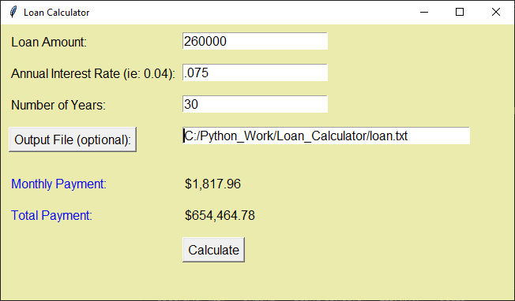
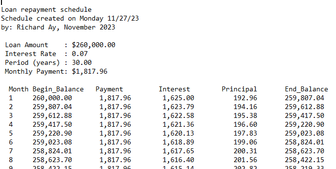

# $`\textcolor{blue}{\text{Directory-Scan}}`$
Loan_Calculator  
Richard Ay (November 2023)  
A script to compute a loan payment and payment schedule.

## $`\textcolor{blue}{\text{Table of Contents}}`$
* [Setup](#setup)
* [Environment](#environment)
* [Usage](#Usage)
* [References](#references)
* [File List](#file-list)
* [Technologies and Imports](#Technologies-and-Imports)
* [Sample Output](#sample-output)

## Setup

There is no special setup needed to run this script.  This script uses Tkinter to 
generate the GUI and acquire the loan details.

## Environment

There is no custom environment needed to run this script. The only requirement is
that Python 3.12 or greater is installed on the machine.

## Usage

This script can be invoked from Windows Explorer or from an IDE (VS Code).

On start-up the input dialog is displayed.  The loan amount, the interest rate, and
the payment period are all required input values.  If the optional output file (path)
is specified, a payment schedule is generated in the (specified) file.

## References

The theory and the equation to compute the loan payment can be found in "Financial Accounting" by
Weil, Schipper, and Francis. See page 715, "Present Value of an Annuity".  

The equation is:  PV = [1 - (1 + r)^-n ] / r  
                     then  
              Periodic Payment = (Loan Amount) / PV  
       
       where: 'r' is the interest rate and 'n' is the number of periods.

## File List
** .gitignore** - The list of files & directories to be excluded from Git source control.   
** Loan_Calc.py** - The file containing the entire script for the loan computations.  

## Technologies and Imports
datetime - used to time-stamp the output  
pathlib  - used for file manipulations  
sys      - used for try/except error processing  
tkinter  - used to generate and interact with the GUI  

## Sample Output
  
# $`\textcolor{blue}{\text{Image of input/output dialog with mocked data.}}`$
  
# $`\textcolor{blue}{\text{Image of optional output text file.}}`$
